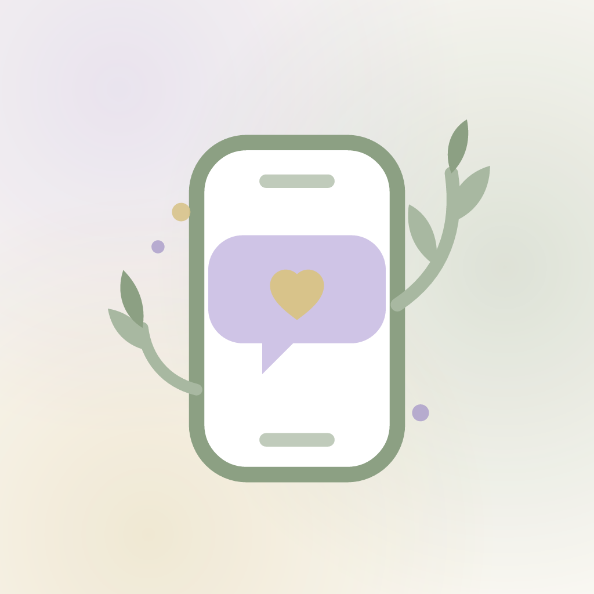

# Guter GeDANKE

*Jeden Tag eine kleine Affirmation.*

A premium, minimalist affirmation app that delivers short, meaningful positive
thoughts throughout the day — like receiving a caring message from a trusted
friend. No feed, no likes, no streaks, no gamification. Just small positive
thoughts.

Built with **Expo (React Native + TypeScript)** for iOS and Android.



## Features

- **Authentication** — Sign in with Apple, Sign in with Google, or e-mail
  sign-up (name + e-mail).
- **Onboarding** — welcome, personalization (name + topics), notification
  preferences (1x/2x/3x daily or custom times), notification permission.
- **Daily affirmations** — the home screen greets you by name and shows the
  *Heutiger GeDANKE* with heart, save and share actions.
- **Push notifications** — locally scheduled per your chosen frequency and
  times ("Ein GeDANKE für dich"), matching your chosen topics, with no
  affirmation repeating within 30 days.
- **Gedanken archive** — every thought that reached you, newest first, with
  full-text search and category filter.
- **Favoriten** — keep the thoughts that felt good.
- **Einstellungen** — edit name, topics, notification frequency and times,
  dark mode, sign out / delete account.

## Topics

Selbstliebe · Motivation · Dankbarkeit · Gelassenheit · Achtsamkeit ·
Beziehungen · Mut · Erfolg · Gesundheit — with a curated German affirmation
library (12 thoughts per topic).

## Design

Warm cream (`#FAF8F3`) surfaces with soft watercolor washes, sage green
(`#A8B8A1`) as the primary voice, light lavender (`#CFC4E6`) and soft gold
(`#D8C38A`) accents, dark charcoal (`#333333`) text. Serif thoughts
(Cormorant Garamond), sans UI (Nunito Sans). Gentle animations, rounded
corners, generous white space, full dark-mode support.

The brand word **DANKE** is always highlighted in gold.

## Getting started

```bash
npm install
npx expo start
```

Then open the app in [Expo Go](https://expo.dev/go), an iOS simulator
(`i`), an Android emulator (`a`), or the browser (`w`).

> Scheduled notifications require a real device or emulator — they are
> gracefully disabled on web.

### Regenerating brand assets

Icon, splash and adaptive icons are rendered from the brand SVG:

```bash
node scripts/generate-assets.js
```

### Sign in with Google (optional)

Google sign-in needs OAuth client IDs. Create them in the Google Cloud
Console and fill in `expo.extra.googleAuth` in `app.json`
(`iosClientId`, `androidClientId`, `webClientId`). Without them the app
falls back to e-mail sign-up. Sign in with Apple works out of the box on
iOS builds (`usesAppleSignIn` is enabled).

## Architecture

```
src/
  app/                  Expo Router routes
    onboarding/         welcome → email → personalization → notifications → permission
    (tabs)/             home (Heute) · gedanken · favoriten · einstellungen
  components/           design-system components (Logo, Chip, ThoughtCard, …)
  constants/theme.ts    palette, typography, spacing, light/dark themes
  data/                 data model + German affirmation library
  services/
    thoughtEngine.ts    daily selection, 30-day no-repeat, 7-day delivery plan
    notifications.ts    local notification scheduling
    auth.ts             Apple / Google sign-in helpers
  store/AppContext.tsx  app state, persisted with AsyncStorage
```

**Data model** (mirrors the product spec): `User`, `Category`, `Thought`,
`UserThought` (delivered archive), `Favorite` — persisted locally.

**Notification logic**: the app plans the next 7 days of deliveries (one
thought per scheduled time, drawn from your topics, never repeating within
30 days), schedules a local notification for each, and settles past-due
deliveries into the archive whenever the app comes to the foreground. If
you open the app before the first delivery of the day, a thought is
delivered immediately so today is never empty.
